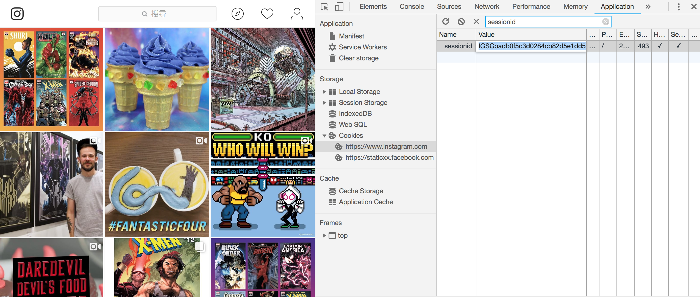
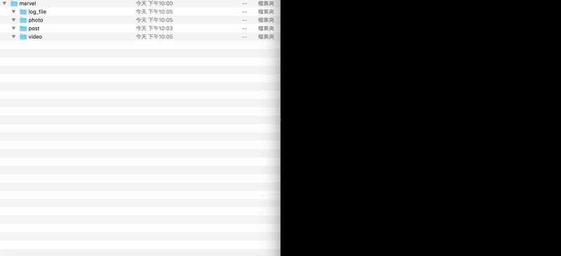

# Instagram Crawler

[](https://badge.fury.io/rb/instagram-crawler)
[](https://codeclimate.com/github/mgleon08/instagram-crawler/maintainability)
[](https://travis-ci.org/mgleon08/instagram-crawler)
[](https://coveralls.io/github/mgleon08/instagram-crawler?branch=master)
[](https://hakiri.io/github/mgleon08/instagram-crawler/master)
[](https://github.com/mgleon08/instagram-crawler/blob/master/LICENSE.txt)


> The easiest way to download instagram photos, posts and videos.


### Instagram Crawler is a ruby gem to crawl instagram photos, posts and videos for download.

## Installation

```
$ gem install instagram-crawler
```

## Setting env variable

```
export sessionid=[your instagram sessionid]
```



## Getting Started



### Show all file link

`-u || --user_name`

```ruby
instagram-crawler -u <user_name>
```

### Download files after this date (YYYYMMDD)

`-a || --after `

```ruby
instagram-crawler -u <user_name> -d -a 20181120
```

### Generate log file

`-l || --log `

```ruby
instagram-crawler -u <user_name> -l
```

### Proxy

`-P || --proxyname ` `-p || --port`

```ruby
instagram-crawler -u <user_name> -P http://example.com -p 1234
```

### Help

`instagram-crawler -h | --help`

```ruby
Usage:
  instagram-crawler [options]
  See https://github.com/mgleon08/instagram-crawler for more information.

options:
    -u, --username USERNAME          Instagram username
    -d, --download                   Download files
    -a, --after DATE                 Download files after this date (YYYYMMDD)
    -l, --log                        Generate a log file in the current directory
    -P, --proxyname PROXYNAME        Specify proxyname of your proxy server
    -p, --port PORT                  Specify port of your proxy server (default port: 8080)
    -v, --version                    Show the instagram-crawler version
    -h, --help                       Show this message
```

## Docker

```docker
# make sure already setting env variable
# you can setting sessionid in local use $sessionid or pass sessionid to docker
# $PWD/instagram-crawler is file store path

# pull image
docker pull mgleon08/instagram-crawler

# docker run
docker run -it --rm -v $PWD/instagram-crawler:/instagram-crawler -e sessionid=$sessionid --name marvel mgleon08/instagram-crawler -u marvel -a 20181124 -d -l
```

## Contributing

Bug reports and pull requests are welcome on GitHub at [`https://github.com/mgleon08/instagram-crawler/pulls`](https://github.com/mgleon08/instagram-crawler/pulls)

## License

* Copyright (c) 2018 Leon Ji. See [LICENSE.txt](https://github.com/mgleon08/instagram-crawler/blob/master/LICENSE.txt) for further details.
* The gem is available as open source under the terms of the [MIT License](https://opensource.org/licenses/MIT).
